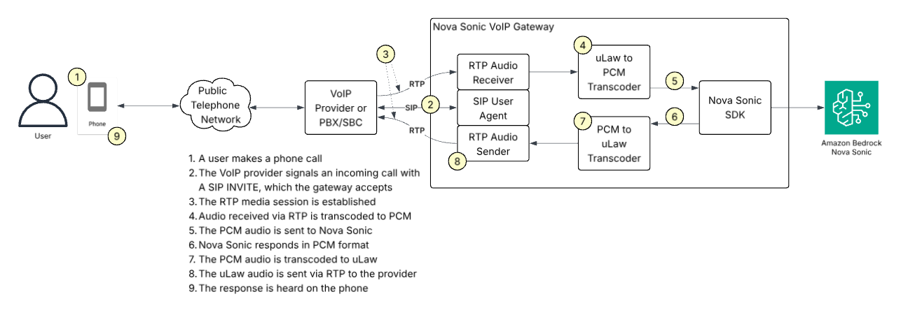
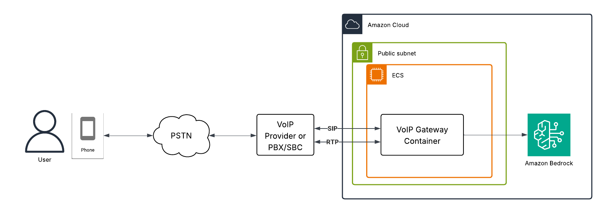

# Nova S2S VoIP Gateway

This project contains an implementation of a SIP endpoint that acts as a gateway to Nova Sonic speech to speech.
In other words, you can call a phone number and talk to Nova Sonic.

<!-- TOC -->
* [How does this work?](#how-does-this-work-)
* [Getting started with ECS and CDK](#getting-started-with-ecs-and-cdk)
* [Getting started with EC2](#getting-started-with-ec2)
* [Third Party Dependencies of Note](#third-party-dependencies-of-note)
* [Environment Variables](#environment-variables)
* [Networking](#networking)
* [Build](#build)
* [Maven settings.xml](#maven-settingsxml)
* [Developer Guide](#developer-guide)
* [License](#license)
<!-- TOC -->

Requirements:
* A SIP account on a SIP server.  There are a number of options for this, whether it be a public VoIP provider or an account on your own PBX.
* Your workstation should have Node.js installed.  This is required for CDK.  See https://nodejs.org/en/download.
* Your workstation should have CDK installed.  See https://docs.aws.amazon.com/cdk/v2/guide/getting_started.html.

You should have some knowledge of Voice over IP (VoIP) and SIP.  

Please be aware that this is just a proof of concept and shouldn't be considered production ready code.

## How does this work?  

This application acts as a SIP user agent.  When it starts it registers with a SIP server.  Upon receiving a call it will answer, establish the media session (over RTP), start a session with Nova Sonic, and bridge audio between RTP and Nova Sonic.  Audio received via RTP is sent to Nova Sonic and audio received from Nova Sonic is sent to the caller via RTP.



## Getting started with ECS and CDK

This application can run in an EC2 backed ECS container running in host mode.  This enables it to bind large UDP port ranges that are required for RTP.  This guide details how to install using infrastructure as code with CDK.



Additional Requirements:
* Your workstation should have Docker installed and Docker should be running.  This is required to build the Docker image.  See https://docs.docker.com/get-started/get-docker/.

Installation:
1. Build the Maven project.  See the build section for details.
2. Copy `target/s2s-voip-gateway-<version>.jar` to the docker/ directory. 
3. Copy cdk-ecs/cdk.context.json.template to cdk-ecs/cdk.context.json
4. Open cdk-ecs/cdk.context.json in your favorite text editor and set each of the configuration parameters.
5. From a terminal run the following:
   ```
   cd cdk-ecs
   npm install
   cdk bootstrap
   cdk deploy
   ```
6. Once the project is fully deployed try calling the phone number or extension for your SIP account.  The gateway should answer immediately and greet you.
7. Converse with Nova Sonic. 

What does this CDK stack do?
* Create a VPC for your installation
* Create VPC endpoints for Elastic Container Registry (ECR)
* Create an Elastic Container Service (ECS) cluster
* Create an auto-scaling group
* Create task execution and task roles
* Create secrets for your SIP credentials
* Create a task and service for VoIP Gateway

Clean-up:
```
cd cdk-ecs
cdk destroy
```

## Getting started with EC2

The Nova S2S VoIP Gateway can run in a configuration as simple as a single EC2 instance.  If you're doing development and testing changes this is the recommended approach.  

We've included a CDK stack to create an EC2 instance with the proper permissions and security groups configured.  To install it, do the following:
1. If you don't already have a keypair, create one from the EC2 console.  This is needed to authenticate to your instance.
2. (optional) If you prefer to use an existing VPC, edit cdk-ec2-instance/bin/cdk.ts, uncomment the line with vpcId and update it to your existing VPC.  The VPC must have public subnets.
3. Open cdk-ec2-instance/bin/cdk.ts in a text editor and update keyPairName to the name of the existing or newly created keypair.
4. From a terminal run the following:
   ```
   cd cdk-ec2-instance
   npm install
   cdk bootstrap
   cdk deploy
   ```
5. CDK will output the IP address of your newly created EC2 instance.

What does this CDK stack do?
* Create a new VPC for your instance (unless configured to use an existing one)  
* Create an IAM role for your instance
* Create security groups for your instance
* Create the EC2 instance with Amazon Linux, configured to install a JDK (Amazon Corretto), Maven, and Git.

To run the project:
1. SSH into the EC2 instance using the keypair from step 1 of the installation guide and IP address from step 5.
2. Copy the project from your local computer or git clone it to your EC2 instance.
3. Configure your Maven settings.xml as detailed in the Maven settings.xml section.
4. Run the project as follows: `./run.sh` (this will compile and execute the main class)
5. Watch for the SIP registration.  Make sure it gets a 200 response.  If it doesn't your credentials may be incorrect.
6. Call the phone number or extension for your SIP line.  The gateway should answer immediately and greet you.
7. Converse with Nova Sonic.
8. Hit Ctrl-C to exit.

Clean-up:

From a terminal run the following:
   ```
   cd cdk-ec2-instance
   cdk destroy
   ```

## Third Party Dependencies of Note

This project utilizes a fork of the mjSIP project, which can be found at https://github.com/haumacher/mjSIP, which is licensed under GPLv2.

## Environment Variables

This project can be configured to run via the `.mjsip-ua` configuration file OR by setting environment variables.  Below is a list of the environment variables in use:

* AUTH_USER - username for authentication with SIP server
* AUTH_PASSWORD - password for authentication with SIP server
* AUTH_REALM - the SIP realm to use for authentication
* DEBUG_SIP - true|false to enable/disable logging SIP packets
* DISPLAY_NAME - the display name to send for your SIP address
* GREETING_FILENAME - the name of the wav file to play as a greeting.  Can be an absolute path or in the classpath.
* MEDIA_ADDRESS - the IP address to use for RTP media traffic.  By default it will source the address from your network interfaces.
* MEDIA_PORT_BASE - the first RTP port to use for audio traffic
* MEDIA_PORT_COUNT - the size of the RTP port pool used for audio traffic
* NOVA_PROMPT - the prompt to use with Amazon Nova.  The default value can be found in NovaMediaConfig.java.
* NOVA_VOICE_ID - the Amazon Nova Sonic voice to use.  See https://docs.aws.amazon.com/nova/latest/userguide/available-voices.html.  Default is matthew.
* SIP_KEEPALIVE_TIME - frequency in milliseconds to send keep-alive packets
* SIP_SERVER - the hostname or IP address of the SIP server to register with.  Required if running in environment variable mode.
* SIP_USER - equivalent of sip-user from `.mjsip-ua`, generally the same as AUTH_USER
* SIP_VIA_ADDR - the address to send in SIP packets for the Via field.  By default it will source the address from your network interfaces.

If SIP_SERVER is set the application will pull configuration from environment variables.  If it is not set it will use the `.mjsip-ua` file.

## Networking

mjSIP doesn't contain any uPNP, ICE, or STUN capabilities, so it's necessary that your instance be configured with the proper security groups to allow VoIP traffic.

Inbound rules:
* Permit inbound UDP traffic on port 5060 (SIP port)
* Permit inbound UDP traffic on port range 10000-20000 (RTP ephemeral ports).  The range can be set via the MEDIA_PORT_BASE and MEDIA_PORT_COUNT environment variables.  Set this to an appropriate value for your configuration.

Outbound rules:
* Permit all outbound.

If you want to override addresses that are used with SIP traffic you can do so by running in environment variable mode.  See Environment Variables for more information on how to do this and what can be configured.

## Build

The Nova S2S VoIP Gateway is a Java Maven project.  As such it requires a JDK to build.  The project is configured for
Java 9 compatibility, but can be built with much more recent releases.  Here are some options:
* Corretto: https://aws.amazon.com/corretto
* OpenJDK: https://developers.redhat.com/products/openjdk/overview
* Oracle: https://www.oracle.com/java/technologies/downloads/

Additionally, Apache Maven is required to do the build.  This can be downloaded from https://maven.apache.org/ or installed on Amazon Linux using the command `sudo yum install maven`.  Unzip Maven in a place where you'll be able to find it again. See "Maven settings.xml" below for details about configuring Maven.

To build the project, open a terminal and cd to the project directory.  Run "mvn package" (you may need to put the full /path/to/maven/bin/mvn if the bin directory is not in your system PATH).

Maven will build the project and create an s2s-voip-gateway*.jar file in the target/ directory.

## Maven settings.xml

mjSIP is distributed from a GitHub Maven repository.  Unfortunately, GitHub Maven repositories require credentials.  You will need to set up a classic API token with GitHub (https://github.com/settings/tokens), if you haven't already, and configure that in your ~/.m2/settings.xml file:

```
<?xml version="1.0" encoding="UTF-8"?>

<settings xmlns="http://maven.apache.org/SETTINGS/1.0.0"
          xmlns:xsi="http://www.w3.org/2001/XMLSchema-instance"
          xsi:schemaLocation="http://maven.apache.org/SETTINGS/1.0.0 http://maven.apache.org/xsd/settings-1.0.0.xsd">
    <servers>
        <server>
            <id>github</id>
            <username>YOUR_USERNAME</username>
            <password>YOUR_AUTH_TOKEN</password>
        </server>
    </servers>
</settings>
```

## Developer Guide

The entrypoint for the application is NovaSonicVoipGateway.java.  This class contains a main method and configures the user agent based on what it finds in environment variables.

The main entry point for the Nova integration is in NovaStreamerFactory.java, where the Bedrock client is instantiated and the audio streams are established.

By default, the gateway includes a toolset that gives Nova Sonic the ability to retrieve the date and time, but this can be extended to do much more.  The example tools can be found in com.example.s2s.voipgateway.nova.tools.

New tools can be developed by extending the AbstractNovaS2SEventHandler class and implementing the functionality you desire.  See the javadoc in AbstractNovaS2SEventHandler for more information.  An easy starting point for new tools would be to copy the DateTimeNovaS2SEventHandler to a new file, replacing the tools with something relevant to your use case.

The tool set is instantiated in NovaStreamerFactory.createMediaStreamer().  If you create new tools you'll need to update the NovaS2SEventHandler to instantiate your new class.


## License

MIT-0 License.  See the LICENSE file for more details.
